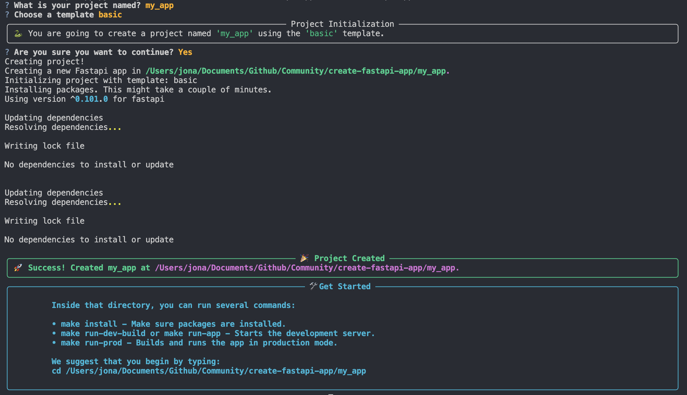

# Create FastAPI Project

We love ❤️ [FastAPI](https://fastapi.tiangolo.com/) and its ecosystem so we decided to make easier to get started with [FastAPI](https://fastapi.tiangolo.com/) projects. By using the `create-fastapi-project` CLI tool, you can quickly start building a new FastAPI application with a basic folder structure, with everything set up for you.

To get started, use the following command:

```bash
pip install create-fastapi-project
create-fastapi-project
```

After you that you are going to see an interactive screen like this:
<p align="center">
  
</p>

## Getting Started

The commands in this documentation can be customized on the **Makefile**. It can be started with and without docker.

After your project is created. First, make sure you have all packages installed:

```bash
make install
```


Run the server:
```bash
# Run locally without docker
make run-app
# or
# Run locally with docker in dev mode and force build
make run-dev-build
# or
# Run locally with docker in dev mode
make run-dev-build
# or
# Run locally with docker in prod mode
make run-prod
```


## Learn More

To learn more about Fastapi, take a look at the following resources:

- [Fastapi Documentation](https://fastapi.tiangolo.com/).
- [fastapi-alembic-sqlmodel-async](https://github.com/jonra1993/fastapi-alembic-sqlmodel-async).
- [full-stack-fastapi-postgresql](https://github.com/tiangolo/full-stack-fastapi-postgresql).
- [sqlmodel-tutorial](https://sqlmodel.tiangolo.com/tutorial/fastapi/).
- [asyncer-tutorial](https://asyncer.tiangolo.com/tutorial/).
- [fastapi-pagination](https://github.com/uriyyo/fastapi-pagination).
- [fastapi-best-practices](https://github.com/zhanymkanov/fastapi-best-practices).
- [awesome-fastapi](https://github.com/mjhea0/awesome-fastapi).

## Why use Create FastAPI Project?

`create-fastapi-project` provides a streamlined way to kickstart your FastAPI projects. Here are some compelling reasons to choose it for your project setup:

### Interactive Experience

Running `create-fastapi-project` (with no arguments) launches an interactive experience that guides you through the process of setting up your project. This interactive approach simplifies the initial configuration and gets you started quickly.

### Zero Dependencies

`create-fastapi-project` has been designed to be lightweight and efficient. It requires zero external dependencies, ensuring that your project remains unburdened by unnecessary packages.

### Reliability and Maintenance

`create-fastapi-project` is maintained by the [Allient development team](https://www.allient.io/). Our team is composed by a experienced professionals specializing in FastAPI projects and NLP. If you need assistance or support for your project, please don't hesitate to get in touch with us at [info@allient.io](mailto:info@allient.io) or schedule a meeting with us [here](https://calendly.com/jonathanvargas).


You can check out the [create-fastapi-project GitHub repository](https://github.com/allient/create-fastapi-project) - your feedback and contributions are welcome ❤️!


## License

[](http://badges.mit-license.org)

- This project is licensed under the terms of the **[MIT license](LICENSE)**
